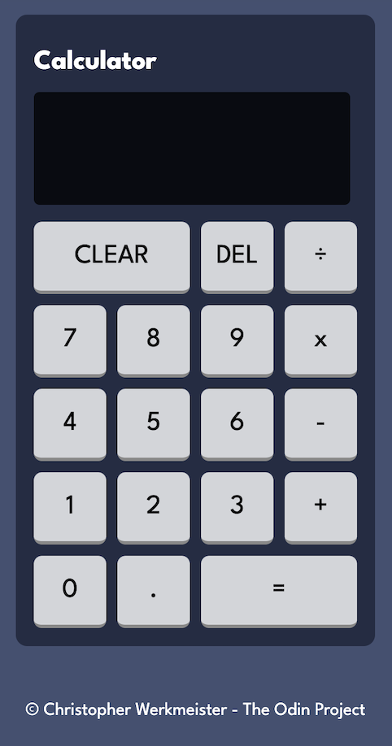

# Frontend Mentor - Calculator app solution

This is a solution to the [Calculator app challenge on The Odin Project](https://www.theodinproject.com/lessons/foundations-calculator). The final project which is part of the foundations course.

## Table of contents

- [Overview](#overview)
  - [The challenge](#the-challenge)
  - [Screenshot](#screenshot)
  - [Links](#links)
- [My process](#my-process)
  - [Built with](#built-with)
  - [What I learned](#what-i-learned)
  - [Code that I am proud of](#code-that-I-am-proud-of)

## Overview

From The Odin Project:

You made it! By now you should have a really firm grasp on the fundamentals of JavaScript. Of course there’s plenty more to learn, but you should be able to create quite a bit at this point. Our final project is going to combine everything you’ve learned so far: you’re going to make an on-screen calculator using JavaScript, HTML, and CSS.

As usual with these things, there are elements of this project that are not going to be trivially easy for you, but if you’ve been following the course so far, you definitely have everything you need to finish it. We’re going to walk you through the various steps you can take, but again, how you actually implement them is up to you!

### The challenge

Build a simple, fully functional calculator using HTML, CSS, and Javascript.

### Screenshot



### Links

- Solution URL: [Add solution URL here](https://github.com/xAnDrOm3dAx/calculator-app)
- Live Site URL: [Add live site URL here](https://xandrom3dax.github.io/calculator-app/)

## My process

I used multiple sources to compile the code needed, and I refactored the code in my own way to get a better understanding of what is happening and to make it work.

### Built with

- Semantic HTML5 markup
- CSS custom properties
- Flexbox
- CSS Grid
- Vanilla Javascript

### What I learned

1. Using variables to switch inputs and outputs.
2. Playing with different ways to create a function - function declarations & arrow functions.
3. Getting more confident with the addEventListener Syntax.
4. Utilizing the event.target property.

### Code that I am proud of

```js
function evaluate() {
  let result;

  const add = (a, b) => a + b;
  const subtract = (a, b) => a - b;
  const multiply = (a, b) => a * b;
  const divide = (a, b) => a / b;

  const current = Number(currentValue);
  const previous = Number(previousValue);

  // Check if there is a valid operator
  if (!operator) {
    currentValue = ""; // Clear the result if there's no operator
    return;
  }

  // Check if values are numbers before evaluating, if not, exit function.
  if (isNaN(previous) || isNaN(current)) {
    return;
  } else {
    switch (operator) {
      case "+":
        result = add(current, previous);
        break;
      case "-":
        result = subtract(previous, current);
        break;
      case "x":
        result = multiply(current, previous);
        break;
      case "÷":
        result = divide(previous, current);
        break;
      default:
        return;
    }
  }

  // Use this function to round the result to 5 decimal places.
  function roundNumber(value) {
    return Number(value.toFixed(5));
  }

  currentValue = roundNumber(result);
  operator = "";

  // Convert the result to a string to ensure currentValue remains a string
  currentValue = currentValue.toString();
  previousValue = previousValue.toString();
}
```
